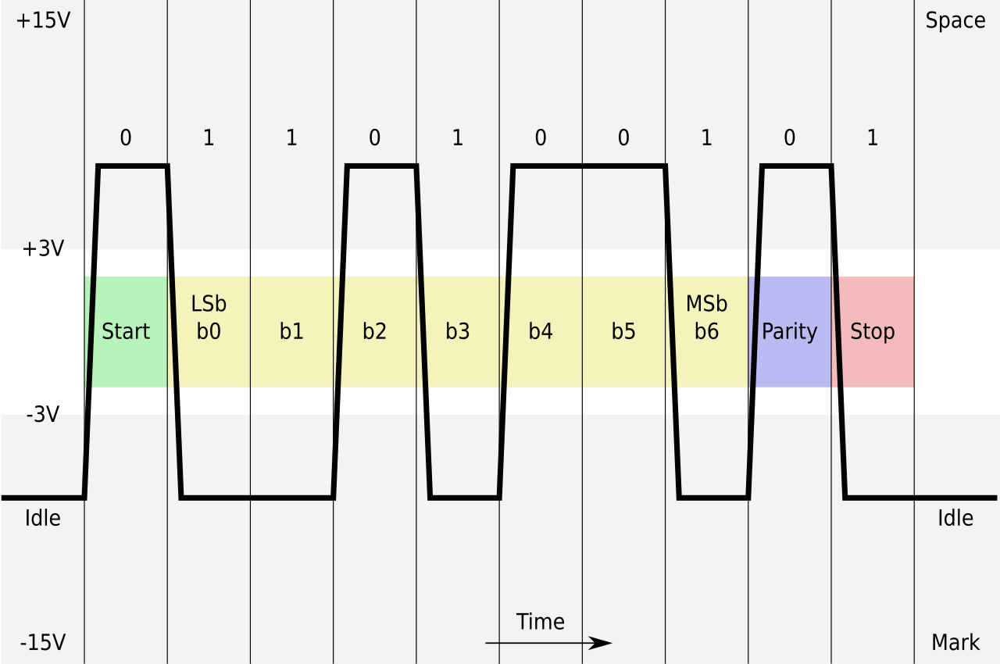

> Diese Seite bei [https://calliope-net.github.io/modem/](https://calliope-net.github.io/modem/) öffnen

# Modem - Datenübertragung mit Licht
### asynchrone serielle Datenübertragung nach [RS-232](https://de.wikipedia.org/wiki/RS-232)

Die 60 Jahre alte Methode, Nullen und Einsen zwischen zwei Computern zu übertragen, funktioniert auch mit Licht. 
Wie bei einer Lichtschranke wird jedes Bit als `Licht an` oder `Licht aus` übertragen. 

LED als Sender und Fototransistor als Empfänger sind aber an verschiedene Computer angeschlossen.
Geeignet sind alle Controller, die LED und Fototransistor ansteuern können. Dazu gehören Calliope und sämtliche fischertechnik Controller.
Damit können Bytes zwischen verschiedenen Systemen übertragen werden, die sonst nicht kompatibel sind.

Die hier beschriebenen Programme übertragen 7-Bit ASCII Zeichen. Für die Eingabe von Text beim Sender und die Ausgabe / Anzeige beim Empfänger haben die Controller unterschiedliche Möglichkeiten. 
Für die Ansteuerung von Tastaturen und Displays sind für alle Controller (I²C)-Erweiterungen verfügbar.
Die Erweiterung Modem kümmert sich nur um die Übertragung von Text-Zeichen, nicht um die Ein- und Ausgabe.

Die ASCII Codierung der Buchstaben, Ziffern und sonstigen Zeichen steht in der [Codetabelle](png/ascii-0-127.pdf).
Die 128 Zeichen mit dem Code 0 bis 127 werden in 7 Bit = 7 Nullen oder Einsen codiert. Das achte Bit ist beim ASCII Code immer 0.

Zum Beispiel wird der Buchstabe `K` codiert in `(0)1 0 0 1 0 1 1`.\
Diese 7 Bit werden einzeln ← von links nach rechts ← gesendet.\
Im folgenden Bild stehen die 7 gelben Bits `1 1 0 1 0 0 1` b0 bis b6 für das Zeichen `K`.

Ist die dicke schwarze Linie unten (Idle) bedeutet das `Licht aus`, oben `Licht an`.
Der Abstand zwischen den dünnen Linien ist die Zeit, wie lange das Licht für ein Bit an oder aus ist.

Wenn nichts übertragen wird, ist das Licht aus. Jedes Zeichen beginnt mit Licht an (grünes Start-Bit). 
Dann folgen die 7 (gelben) Daten-Bits b0 bis b6. Das (lila) Parity-Bit erkennt Übertragungsfehler. Das (rote) Stop-Bit schaltet das Licht wieder aus.

Das Parity-Bit wird so gesetzt, dass die Anzahl Einsen eine gerade Zahl ergibt. Beim `K` sind 4 Einsen (b0 b1 b3 b6) vorhanden, Parity ist 0.
Beim `L` `(0)1 0 0 1 1 0 0` ← von links nach rechts ← `0 0 1 1 0 0 1` sind 3 Einsen vorhanden, Parity ist 1. (3 ist keine gerade Zahl, aber 4).

Bei `Licht an` erkennt der Empfänger den Beginn einer Übertragung. Nach einer halben Taktzeit beginnt er die 10 Bit immer in der Mitte abzutasten.
So werden kleine Unterschiede zwischen den Controllern ausgeglichen. Man nennt das asynchron. 

Pro ASCII Zeichen werden immer 10 Bit übertragen. Die Pause zwischen den Zeichen kann beliebig lang sein. Der Empfänger erkennt an Start-, Parity- und Stop-Bit, ob das Zeichen gültig ist. Und decodiert die 7 Daten-Bit wieder zu einem ASCII Zeichen.

## Blöcke

### beim Start

Block **Pins:** (pin_led, pin_fototransistor, helligkeit=150)
* Definiert beim Start die Pins für LED und Fototransistor und den analogen Wert für hell.
* *pin_led*: DigitalPin, *pin_fototransistor*: AnalogPin
* optional *helligkeit*: number default=150 

Block **Takt:** (takt_ms, start_bit_time=0.5, stop_bits=1)
* Definiert beim Start die Zeit, wie lange das Licht für ein Bit an oder aus ist.
* *takt_ms*: Millisekunden default=400 ms
* optional *start_bit_time*, *stop_bits*

### Senden (LED)

Block **sende 1 Zeichen ASCII Code** (ascii_code)
* Sendet 1 Zeichen (Code)
* *ascii_code*: 32..127 oder 13 für ENTER

Block **sende Text Zeile mit ↵ ENTER** (text)
* Sendet alle Zeichen aus *text* und hängt ENTER (13) an.

### Empfangen (Fototransistor)

Block **empfange 1 Zeichen ASCII Code (oder Fehlercode)** : number
* Wartet auf Start-Bit und gibt nach Empfang den ASCII-Code (0..127) zurück.

Fehlercode|Fehler
---|---
-1|weniger als 10 Bit empfangen
-2|Start-Bit Fehler
-3|Parity-Bit Fehler
-4|Stop-Bit Fehler

Block **empfange Text Zeile bis ↵ ENTER** : string
* Wartet auf Start-Bit und empfängt alle Zeichen bis ENTER (13).
* Gibt dann den Text (ohne ENTER) zurück.
* Gültige ASCII-Codes 32..127 werden in das Zeichen umgewandelt.
* Ungültige und Fehler-Codes werden in den Text als \|-1\| oder \|27\| eingefügt.

> Die zwei Funktionen **empfange** blockieren das Programm. Es reagiert nicht mehr, bis der Fototransistor ein Start-Bit (Licht an) empfangen hat.
> Mit der folgenden Funktion kann in einer eigenen Schleife erkannt werden, ob der Fototransistor hell ist, also der Empfang beginnt.

Block **empfange 1 Bit (warten auf Startbit)** : boolean
* Gibt wahr zurück, wenn der Fototransistor ein Start-Bit erkannt hat. (blockiert nicht)
* Danach muss sofort **empfange 1 Zeichen** oder **empfange Text** aufgerufen werden. (blockiert)

Block **Empfangen abbrechen**
* Kann eine blockierte Funktion **empfange** abbrechen.
* Muss dazu in einem anderen Thread aufgerufen werden, z.B. **wenn Knopf B geklickt**.
* Führt zum Fehlercode \|-1\|, weil keine Daten empfangen wurden.

## Blöcke (mehr)

> Mit den "advanced" Blöcken können die Programmschritte codieren, senden, empfangen, decodieren einzeln abgearbeitet werden. Für einfache "Datenübertragung mit Licht" sind die Blöcke nicht erforderlich.
> Sie werden aber zur Fehlersuche gebraucht, oder um jedes gesendete oder empfangene Zeichen einzeln anzuzeigen. Oder um den Inhalt des 10-bit-Arrays zu verstehen.

### Senden (ASCII Code 32..127)

Block **ASCII Code aus Text** (text, index) : number
* Gibt den ASCII Code des (ersten) Zeichens in *text* zurück.
* Bei mehreren Zeichen gibt der *index* die Position des Zeichens in *text* an.

Block **10 Bit Array aus ASCII Code** (ascii_code) : boolean[]
* Gibt ein Array mit 10 boolean Elementen (wahr/falsch) zurück.
* 1 Start, 7 Daten 2^0..2^6, 1 Parität, 1 Stop-Bit
* negative Logik: 0=wahr und 1=falsch
* Bedeutung ist im Bild oben erklärt.

Block **sende Array von ...** (array_10bit: boolean[])
* Sendet das *array_10bit* über die LED als `Licht an` oder `Licht aus`.
* Zum Testen können die boolean Elemente auch direkt im Block eingestellt werden.
* Normalerweise wird als Parameter eine boolean[] Variable oder Funktion übergeben.

### Empfangen (1 Start, 7 Daten 2^0..2^6, 1 Parität, 1 Stop-Bit)

Block **Text-Zeichen aus ASCII Code** (ascii_code) : string
* Gibt das Zeichen zum *ascii_code* zurück. Genau 1 Zeichen.

Block **ASCII Code aus Array von ...** (array_10bit: boolean[]) : number
* Decodiert das Array mit 10 boolean Elementen (wahr/falsch) in den ASCII Code.
* Bei Fehler werden die Codes -1 .. -4 in der Tabelle oben zurück gegeben.
* Zum Testen können die boolean Elemente auch direkt im Block eingestellt werden.
* Normalerweise wird als Parameter eine boolean[] Variable oder Funktion übergeben.

Block **empfange 10 Bit Array** : boolean[]
* Wartet auf Start-Bit und gibt nach Empfang das 10-bit-Array zurück.
* Funktion blockiert und kann (in einem anderen Thread) abgebrochen werden.
* Bei Abbruch hat das Array keine oder weniger als 10 Elemente.

### Funktionen

Block **Array von ... to Bin-String** : string
* Konvertiert ein boolean[] Array in einen String aus Nullen und Einsen (wahr = 0 und falsch = 1).
* Dient nur zur Anzeige, wird nicht zur Datenübertragung benötigt.
* Nach Bit 0 und 7 wird ein ^ eingefügt zur Abgrenzung der Daten-Bits.

Block **zwischen** (i0, i1, i2)
* Gibt wahr zurück, wenn *i0* zwischen *i1* und *i2* liegt.

Block **Kommentar** (text)
* Einfügen von Kommentar in die Blöcke. Hat keine Funktion.

## Als Erweiterung verwenden

Dieses Repository kann als **Erweiterung** in MakeCode hinzugefügt werden.

* öffne [https://makecode.calliope.cc/](https://makecode.calliope.cc/)
* klicke auf **Neues Projekt**
* klicke auf **Erweiterungen** unter dem Zahnrad-Menü
* nach **https://github.com/calliope-net/modem** suchen und importieren

## Dieses Projekt bearbeiten 

Um dieses Repository in MakeCode zu bearbeiten.

* öffne [https://makecode.calliope.cc/](https://makecode.calliope.cc/)
* klicke auf **Importieren** und dann auf **Importiere URL**
* füge **https://github.com/calliope-net/modem** ein und klicke auf Importieren

## Blocks preview

This image shows the blocks code from the last commit in master.
This image may take a few minutes to refresh.

#### Metadaten (verwendet für Suche, Rendering)

* for PXT/calliopemini

